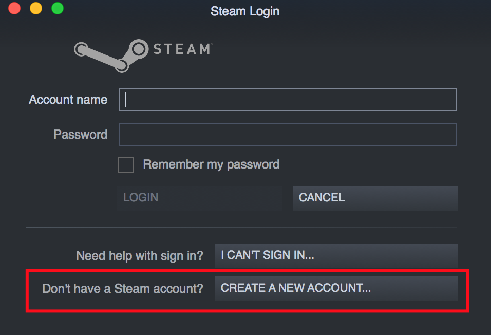

## Install Steam

1. Go to <a href="http://steampowered.com" target="_blank">steampowered.com</a> in your browser.
2. Click Install Steam.

    

3. Click Install Steam Now.
4. Click the show downloads button. Depending on the browser, this may open automatically when the file finishes downloading. 

    

5. Double-click on steam.dmg (mac) or SteamSetup.exe (Win) to launch the installer.
6. Click on Agree button.
7. Drag Steam into the applications folder (mac).
8. Exit the window.

## Create Account

When you open Steam for the first time it will ask you to login or create a new account. If you alread have an account you can use it, otherwise click *Create Account*.

